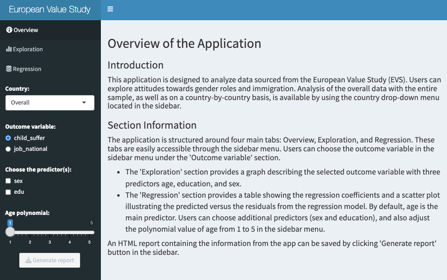
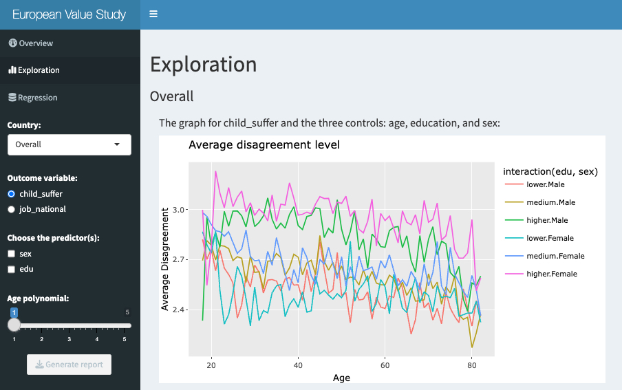

# Attitudes Towards Gender Roles and Immigration Analysis
## -Using data from European Value Study (EVS) 2017-


## Description

The goal of this project is to develop an application that enables users to explore data from [2017 European Value Study (EVS)](https://search.gesis.org/research_data/ZA7500). The data was downloaded on 27 March 2024. This aims to analyze attitudes towards gender roles and immigration. 

Original datasets are data/ZA7500_v5-0-0.sav, and the cleaned data evs.rds was used for generating the app. The variables that are used in developing this application are as below:

-   **v72** - Child suffers with working mother
    -   Question: When a mother works for pay, the children suffer
    -   Scale: 1 (Strongly agree) to 4 (Strongly disagree)
-   **v80** - Jobs are scarce:giving...(nation)priority
    -   Question: When jobs are scarce, employers should give priority to [Nationality] people over immigrants"
    -   Scale: 1 (Strongly agree) to 4 (Strongly disagree)
    
    
    
## Organization of the repo

A markdown file to generate an HTML report can be found in [report.Rmd](https://github.com/sungjoocho7/Modern-workflows-in-data-science-FinalProject/blob/724b9e9a5abd78ea1df0093e07c9ed5172a40f4b/report.Rmd), and the R script to run the Shiny app can be found in [shiny_app.R](https://github.com/sungjoocho7/Modern-workflows-in-data-science-FinalProject/blob/724b9e9a5abd78ea1df0093e07c9ed5172a40f4b/shiny_app.R).


This repository is organized as follows:

-   **/data** - Contains both the [raw data](https://github.com/sungjoocho7/Modern-workflows-in-data-science-FinalProject/blob/fea80922d6e1cbe2dd144fbbf41fe145b83548a4/data/ZA7500_v5-0-0.sav) and [edited data](https://github.com/sungjoocho7/Modern-workflows-in-data-science-FinalProject/blob/fea80922d6e1cbe2dd144fbbf41fe145b83548a4/data/evs.rds) set used in the analysis as well as [codebook](https://github.com/sungjoocho7/Modern-workflows-in-data-science-FinalProject/blob/fea80922d6e1cbe2dd144fbbf41fe145b83548a4/data/ZA7500_cdb.pdf) of the EVS data set.
-   **/script** - Contains a [R script](https://github.com/sungjoocho7/Modern-workflows-in-data-science-FinalProject/blob/fea80922d6e1cbe2dd144fbbf41fe145b83548a4/script/cleaning_evs.R) for data cleaning.
-   **/report** - Contains a sample HTML report with the overall sample data. 
-   **/documentation** - Contains the instructional document.
-   **/figs** - Contains screenshots of the application pages.


## Overview of the application

This application is designed to analyze data sourced from the European Value Study (EVS). Users can explore attitudes towards gender roles and immigration. Analysis of the overall data with the entire sample, as well as on a country-by-country basis, is available by using the country drop-down menu located in the sidebar.

The application is structured around four main tabs: Overview, Exploration, and Regression. These tabs are easily accessible through the sidebar menu. Users can choose the outcome variable in the sidebar menu under the 'Outcome variable' section.

* The 'Exploration' section provides a graph describing the selected outcome variable with three predictors age, education, and sex.

* The 'Regression' section provides a table showing the regression coefficients and a scatter plot illustrating the predicted versus the residuals from the regression model. By default, age is the main predictor. Users can choose additional predictors (sex and education), and also adjust the polynomial value of age from 1 to 5 in the sidebar menu.

An HTML report containing the information from the app can be saved by clicking 'Generate report' button in the sidebar.

 *Figure 1*

 *Figure 2*


#### URL to the application:

https://scho77.shinyapps.io/EVS_application/


## Session info:
```
R version 4.3.1 (2023-06-16)
Platform: aarch64-apple-darwin20 (64-bit)
Running under: macOS Ventura 13.3

Matrix products: default
BLAS:   /System/Library/Frameworks/Accelerate.framework/Versions/A/Frameworks/vecLib.framework/Versions/A/libBLAS.dylib 
LAPACK: /Library/Frameworks/R.framework/Versions/4.3-arm64/Resources/lib/libRlapack.dylib;  LAPACK version 3.11.0

locale:
[1] en_US.UTF-8/en_US.UTF-8/en_US.UTF-8/C/en_US.UTF-8/en_US.UTF-8

time zone: America/New_York
tzcode source: internal

attached base packages:
[1] stats     graphics  grDevices utils     datasets  methods   base     

other attached packages:
 [1] texreg_1.39.3        knitr_1.45           DT_0.30              haven_2.5.3          shinydashboard_0.7.2
 [6] plotly_4.10.4        lubridate_1.9.3      forcats_1.0.0        stringr_1.5.0        dplyr_1.1.3         
[11] purrr_1.0.2          readr_2.1.4          tidyr_1.3.0          tibble_3.2.1         ggplot2_3.4.4       
[16] tidyverse_2.0.0      broom_1.0.5          shiny_1.8.0         

loaded via a namespace (and not attached):
 [1] gtable_0.3.4      xfun_0.41         bslib_0.5.1       htmlwidgets_1.6.2 tzdb_0.4.0        vctrs_0.6.4      
 [7] tools_4.3.1       crosstalk_1.2.0   generics_0.1.3    fansi_1.0.5       pkgconfig_2.0.3   data.table_1.14.8
[13] lifecycle_1.0.3   farver_2.1.1      compiler_4.3.1    munsell_0.5.0     fontawesome_0.5.2 httpuv_1.6.12    
[19] htmltools_0.5.7   sass_0.4.7        yaml_2.3.7        lazyeval_0.2.2    later_1.3.1       pillar_1.9.0     
[25] jquerylib_0.1.4   ellipsis_0.3.2    rsconnect_1.1.1   cachem_1.0.8      mime_0.12         tidyselect_1.2.1 
[31] digest_0.6.33     stringi_1.7.12    labeling_0.4.3    fastmap_1.1.1     grid_4.3.1        colorspace_2.1-0 
[37] cli_3.6.1         magrittr_2.0.3    utf8_1.2.4        withr_2.5.2       scales_1.2.1      promises_1.2.1   
[43] backports_1.4.1   timechange_0.2.0  rmarkdown_2.25    httr_1.4.7        hms_1.1.3         memoise_2.0.1    
[49] evaluate_0.23     viridisLite_0.4.2 rlang_1.1.1       Rcpp_1.0.11       xtable_1.8-4      glue_1.7.0       
[55] rstudioapi_0.15.0 jsonlite_1.8.7    R6_2.5.1         
```
